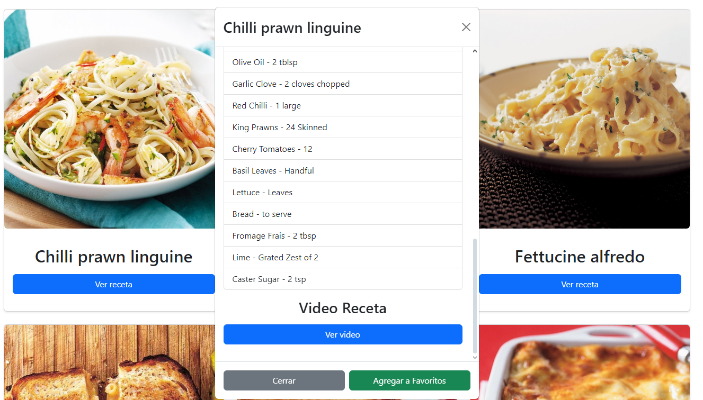
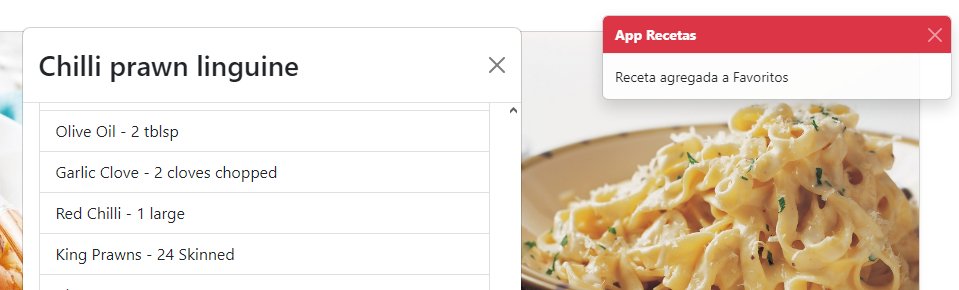
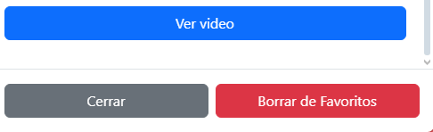
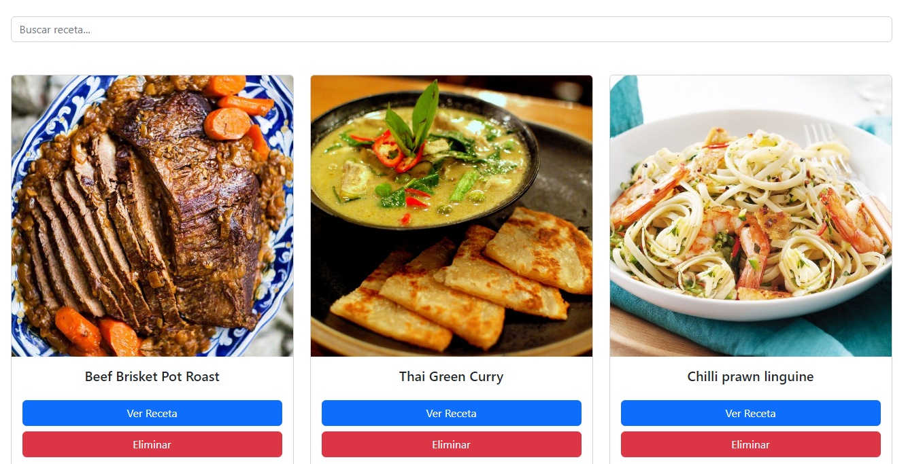
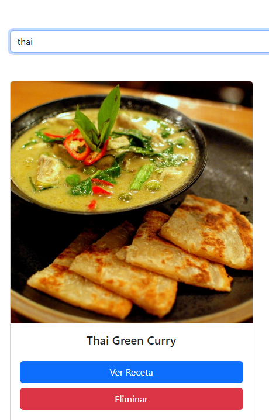
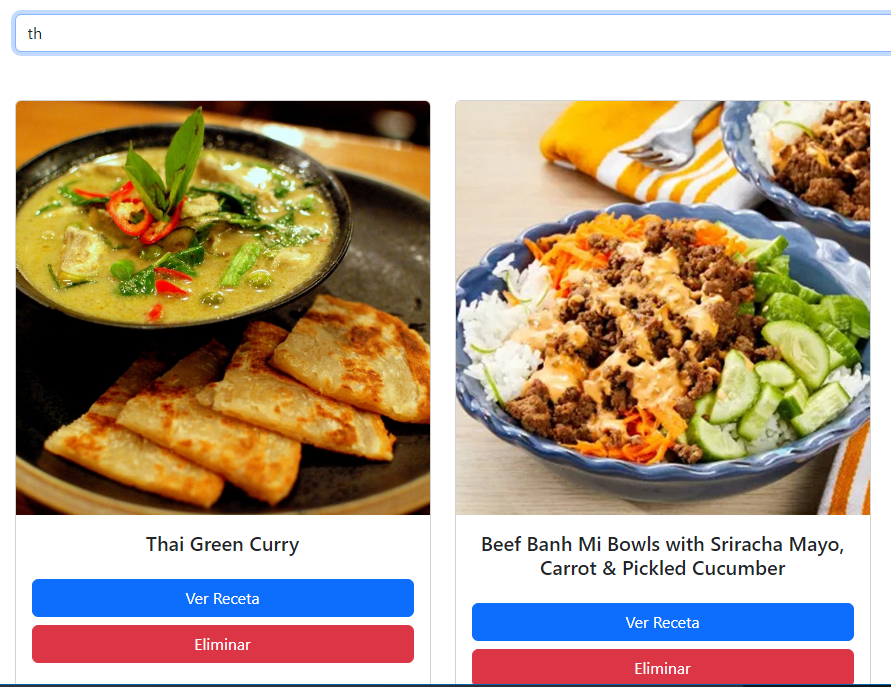
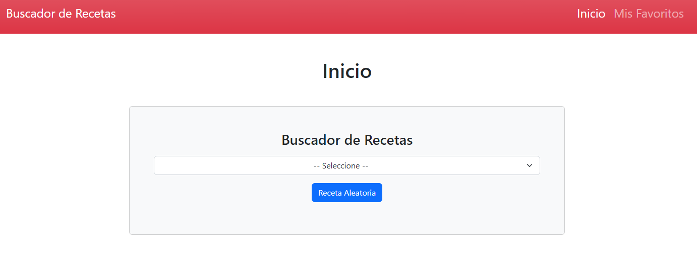
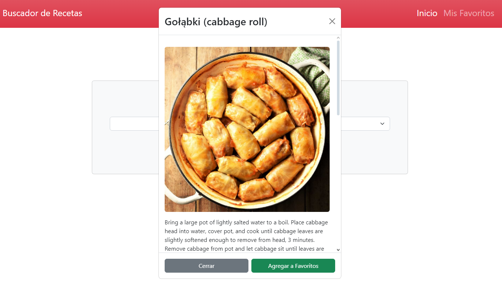
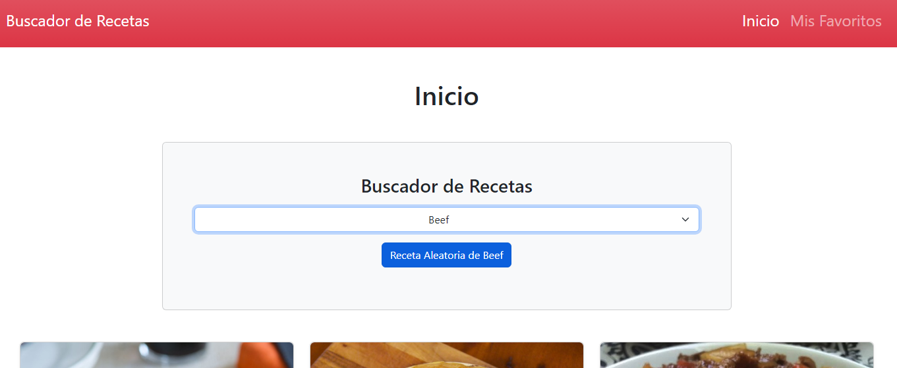
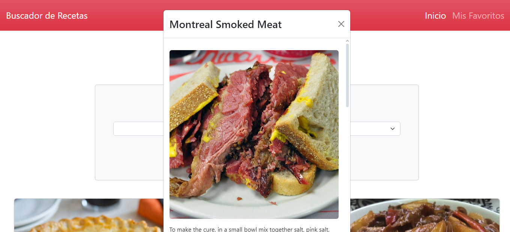

## Persistencia de datos con IndexedDB

La permite al usuario almacenar las recetas seleccionadas en la cache del navegador, para que sean accesibles en cualquier momento sin necesidad de conexión a internet.

https://github.com/rekznoz/PROYECTO-3/blob/4c4e5bd5d9da1a8616888ca84ca12a49fb6ec37f/js/app.js#L367-L381

Cuando se agregue una receta a favoritos se mostrara un mensaje de confirmacion en la parte superior de la pantalla.

El boton de agregar a favoritos pasara a ser un boton para eliminar de los favoritos.

Si vamos a la pestaña de favoritos se mostraran todas las recetas que tengamos guardadas.

## Buscador de Recetas favoritas por nombre

Con un buscador permite al usuario buscar entre todas las recetas que tenga guardadas por el nombre o la plabara clave que desee.

El buscador no solo permite buscar por palabras si no tambien por caracteres que contenga el nombre

## Seleccionador de Recetas aleatorias

Si el usuario no sabe que elegir o quiere lanzarse a la aventura de probar algo diferente, esta la opcion de seleccionar una receta aleatoria, hay dos formas de seleccionarla:

### - Seleccionador de recetas aleatorias por api

la misma api de recetas ofrece una opcion de seleccionar una receta aleatoria de todo su repertorio con una simple consulta.

Cuando pulse el boton de `Receta Aleatoria` se mostrara una receta aleatoria en el modal.

### - Selecionador de recetas aleatorias por categoria seleccionada

Si el usuario desea una aleatoria de una categoria concreta se puede seleccionar la categoria y usar la opcion para selecciiar una receta aleatoria de esa categoria.

Cuando se pulse el boton de `Receta Aleatoria de xxxxx` se mostrara una receta aleatoria de la categoria seleccionada en el modal.

